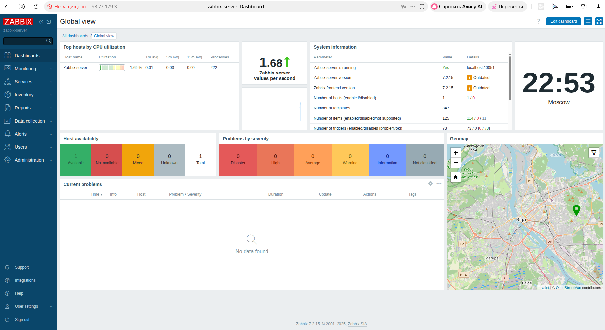
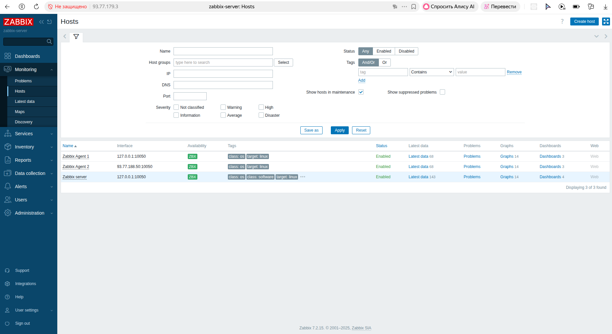
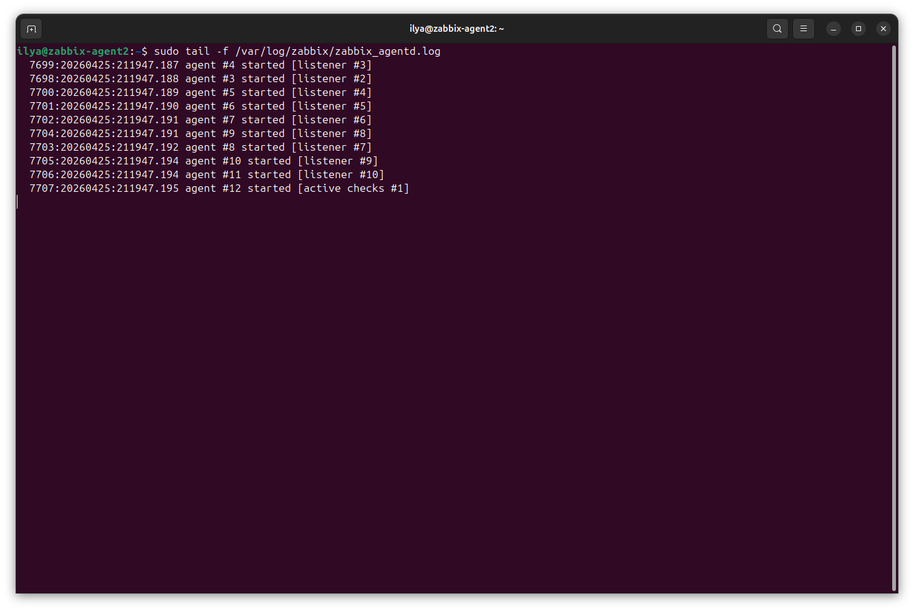

# Домашнее задание к занятию "`Система мониторинга Zabbix`"


### Задание 1

Установите Zabbix Server с веб-интерфейсом.

#### Процесс выполнения
1. Выполняя ДЗ сверяйтесь с процессом отражённым в записи лекции.
2. Установите PostgreSQL. Для установки достаточна та версия что есть в системном репозитороии Debian 11
3. Пользуясь конфигуратором комманд с официального сайта, составьте набор команд для установки последней версии Zabbix с поддержкой PostgreSQL и Apache
4. Выполните все необходимые команды для установки Zabbix Server и Zabbix Web Server

#### Требования к результаты
1. Прикрепите в файл README.md скриншот авторизации в админке
2. Приложите в файл README.md текст использованных команд в GitHub

Решение:

Использованные команды:

1. Установка Postgresql:
```
sudo apt update
sudo apt install postgresql
```
2. Установка репозиторий Zabbix:
```
wget https://repo.zabbix.com/zabbix/7.2/release/ubuntu/pool/main/z/zabbix-release/zabbix-release_latest_7.2+ubuntu24.04_all.deb
sudo dpkg -i zabbix-release_latest_7.2+ubuntu24.04_all.deb
sudo apt update
```
3. Установка Zabbix сервера и веб-интерфейса:
```
sudo apt install zabbix-server-pgsql zabbix-frontend-php php8.3-pgsql zabbix-apache-conf zabbix-sql-scripts zabbix-agent
```
4. Проверка установки zabbix-server:
```
systemctl status zabbix-server.service
```
5. Создание пользователя и базы данных:
```
su - postgres -c 'psql --command "CREATE USER zabbix WITH PASSWORD '\'zabbix\'';"'
su - postgres -c 'psql --command "CREATE DATABASE zabbix OWNER zabbix;"'
```
или

```
sudo -u postgres psql
CREATE USER zabbix WITH PASSWORD 'your_secure_password';
sudo -u postgres createdb -O zabbix zabbix
```
6. Импортирование начальной схемы и данных на хосте Zabbix:
```
zcat /usr/share/zabbix/sql-scripts/postgresql/server.sql.gz | sudo -u zabbix psql zabbix
```
7. Редактирование файла /etc/zabbix/zabbix_server.conf:
```
sudo sed -i 's/# DBPassword=/DBPassword=zabbix/g' /etc/zabbix/zabbix_server.conf
```
8. Запуск процесcа Zabbix сервера и настройка его запуска при загрузке ОС:
```
sudo systemctl restart zabbix-server apache2
sudo systemctl enable zabbix-server apache2
```
9. Проверка запуска zabbix-server:
```
systemctl status zabbix-server.service
```


---

### Задание 2

Установите Zabbix Agent на два хоста.

#### Процесс выполнения
1. Выполняя ДЗ сверяйтесь с процессом отражённым в записи лекции.
2. Установите Zabbix Agent на 2 виртмашины, одной из них может быть ваш Zabbix Server
3. Добавьте Zabbix Server в список разрешенных серверов ваших Zabbix Agentов
4. Добавьте Zabbix Agentов в раздел Configuration > Hosts вашего Zabbix Servera
5. Проверьте что в разделе Latest Data начали появляться данные с добавленных агентов

#### Требования к результаты
1. Приложите в файл README.md скриншот раздела Configuration > Hosts, где видно, что агенты подключены к серверу
2. Приложите в файл README.md скриншот лога zabbix agent, где видно, что он работает с сервером
3. Приложите в файл README.md скриншот раздела Monitoring > Latest data для обоих хостов, где видны поступающие от агентов данные.
4. Приложите в файл README.md текст использованных команд в GitHub

Решение:

Использованные команды:

1. Установка Postgresql:
```
 sudo apt update
 sudo apt install postgresql
```
2. Установка репозиторий Zabbix:
```
wget https://repo.zabbix.com/zabbix/7.2/release/ubuntu/pool/main/z/zabbix-release/zabbix-release_latest_7.2+ubuntu24.04_all.deb
sudo dpkg -i zabbix-release_latest_7.2+ubuntu24.04_all.deb
sudo apt update
```
3. Установка Zabbix агента:
```
sudo apt install zabbix-agent
```
4. Запуск процесcа Zabbix агента и настройка его запуска при загрузке ОС:
```
sudo systemctl restart zabbix-agent
sudo systemctl enable zabbix-agent
```
5. Проверка запуска zabbix-agent:
```
systemctl status zabbix-agent.service
```
6. Добавление адреса zabbix-server в zabbix-agent.conf на хостах:
```
sudo sed -i 's/Server=127.0.0.1/Server=193.77.179.3/g' /etc/zabbix/zabbix_agentd.conf
```
7. Рестарт Zabbix-agent на обоих хостах:
```
sudo systemctl restart zabbix-agent.service
```
8. Проверка запуска zabbix-agent:
```
systemctl status zabbix-agent.service
```
9. Просмотр лога Zabbix-agent:
```
sudo tail -f /var/log/zabbix/zabbix_agentd.log
```


---